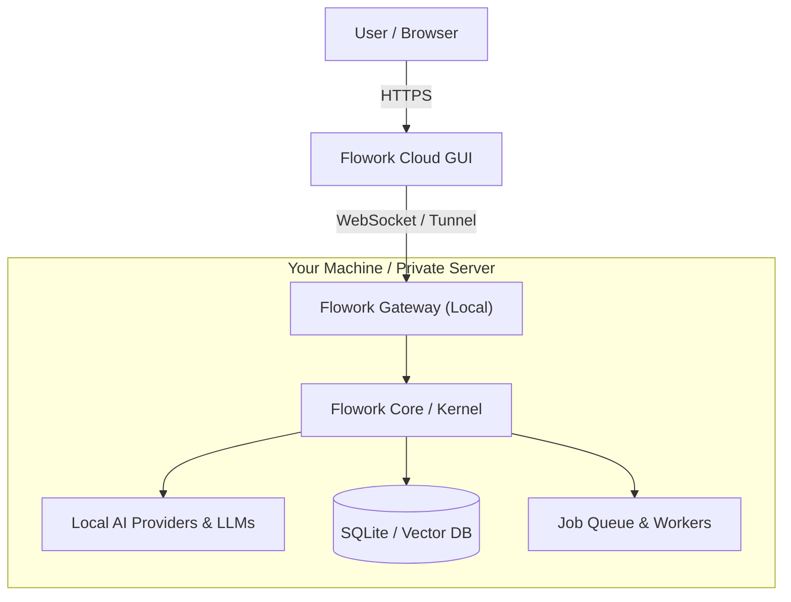

---

<div align="center">
<a href="[https://flowork.cloud](https://flowork.cloud)">

</a>

<h1 align="center">Flowork: The Hybrid AI OS</h1>

<p align="center">
<strong>The ultimate powerhouse for secure, local-first automation & AI orchestration. No cap.</strong>
</p>

<p align="center">
<a href="[https://flowork.cloud](https://flowork.cloud)"><strong>🌐 The Mothership</strong></a> •
<a href="[https://docs.flowork.cloud](https://docs.flowork.cloud)"><strong>📚 The Lore</strong></a> •
<a href="#-getting-started"><strong>🚀 Send It</strong></a>
</p>

<p align="center">


</p>
</div>

---

## ⚡ What is Flowork?

**Flowork** isn't just another mid chatbot. It’s a full-blown **Hybrid AI Ecosystem** built to disrupt how we handle **Workflow Automation**.

Forget those "cloud-only" platforms (Zapier, Make) that low-key spy on your data. Flowork splits the vibe:

* **☁️ The Brain (Cloud GUI):** A sleek, globally distributed UI via Cloudflare Pages. Looks clean, runs fast.
* **💻 The Muscle (Local Engine):** The heavy lifting, LLM inference, and data processing stay on **YOUR** hardware via a secure tunnel.

**Your Data. Your GPU. Your Rules. Pure Sovereignty.**

---

## 🔥 Key Capabilities

Flowork blends No-Code simplicity with "God-Mode" Python scripting and Local AI.

### 🛡️ 1. Privacy is the Vibe

GUI in the cloud, Engine on your local machine. Your files, API keys, and datasets never leave your house unless you say so.

* **The Flex:** Enterprise-grade security with the smoothest SaaS experience.

### 🧠 2. AI Council Orchestrator

Stop talking to one bot. Flowork lets you summon a **Council of Agents** (The Architect, The Coder, The Reviewer). They debate, plan, and execute complex tasks while you just watch the magic happen.

### 🏭 3. Local AI Factory (Trainer & Forge)

Don't just rent AI—be the owner. Use the **AI Trainer** to fine-tune models (GGUF/LoRA) on your own data using your local GPU. Build custom components in the **Forge** like a pro.

### 🎨 4. Limitless Visual Designer

Drag-and-drop your way to peak productivity. Build logic flows, connect APIs, and automate everything without writing a single line of code (unless you want to).

### ⏪ 5. Time-Travel Debugger

Flowork’s engine has **Episodic Memory**. If something breaks, literally step back in time, check the states, and fix it instantly. It’s like a "undo" button for your entire workflow.

---

## 📂 The Ecosystem

Three pillars to make sure your automation game is cracked.

### 1. CORE (The Builder)

* **Designer:** Your visual playground. Connect nodes and data.
* **Dashboard:** Real-time stats on your engines and system health.
* **Widgets:** Micro-apps for the niche stuff (Neural Music, Video AI, etc.).
* **Marketplace:** Grab community modules and workflow templates.

### 2. AI SUITE (The Intelligence)

* **AI Center:** Where your Autonomous Agents and Council hang out.
* **Component Forge:** A factory for your custom Python/JS modules.
* **AI Trainer:** Train your own models on your own terms.
* **Prompt Manager:** Store and optimize your "secret sauce" prompts.

### 3. SYSTEM (The Infrastructure)

* **My Engines:** Manage your local rigs or remote servers.
* **Diagnostics:** Self-healing tools to keep your Engine and Tunnel healthy.
* **Documentation:** The actual manual for when you want to go deep.

---

## 🏗️ Architecture Overview



---

## 🚀 Getting Started

### Prerequisites

* **Docker** (The easy way) OR Python 3.10+
* **Node.js 18+** (Only if you're building the GUI)
* A free account at [flowork.cloud](https://flowork.cloud/register)

### Option A: Docker Run (Fastest 🏃💨)

1. **Clone the Repo**

```bash
git clone https://github.com/flowork-dev/Visual-AI-Workflow-Automation-Platform.git
cd floworkos

```

2. **Ignite the Engine**

```bash
# Windows
3-START_FAST.bat

# Linux/Mac
docker-compose up -d

```

3. **Connect**
Hit the [Cloud Dashboard](https://flowork.cloud/login), head to **My Engines**, and link your rig.

---

## 🛠️ Tech Stack

* **Frontend:** Vue 3, Vite, Pinia (The modern trio).
* **Backend:** Python 3.10+, FastAPI/Flask, SQLAlchemy.
* **Infra:** Cloudflare Pages & Tunnels, Docker.
* **AI Engine:** Supports Local (GGUF, Llama.cpp) + The Big Guys (OpenAI, Anthropic).

---

## 🤝 Contributing

We’re building the future here. If you've got the skills, we want your PRs! Check the [CONTRIBUTING.md](https://github.com/flowork-dev/Visual-AI-Workflow-Automation-Platform?tab=contributing-ov-file) for the ground rules.

---

## 📄 License

Licensed under the **Flowork Community License** (Modified MIT).

> **Commercial Use? Bet.** Just two rules:
> 1. **Give Credit:** Keep "Powered by Flowork" visible. Don't be that person.
> 2. **Keep it Connected:** Don't mess with the Marketplace connectivity.
>
>

---

<p align="center">
Built with ❤️ by the <strong>Flowork Team</strong>.

<em>Automate. Integrate. Accelerate.</em>

</p>

---

